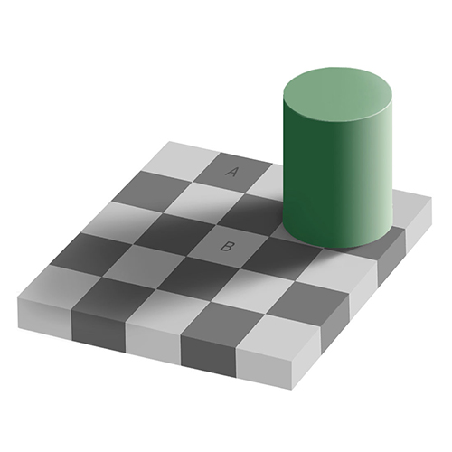
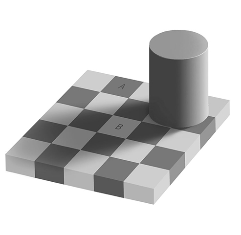
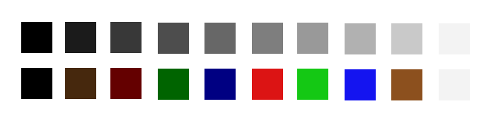
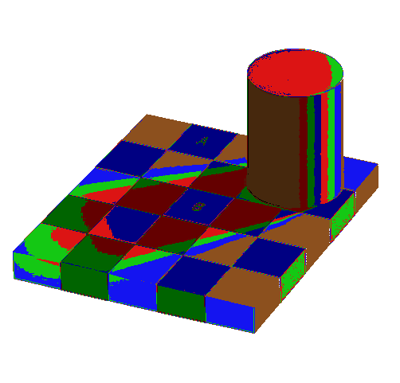

# Processing 3 program to help artists visualize values (lightness/darkness) 

 

This is the famous checkerboard illusion:

Even though the squares marked A and B do not look like it, they are identical colors!

 

Converting the image to greyscale (i.e., black and white) does not help see through the illusion:

This program, written in Processing 3, converts any grey scale image the series of colors shown in the scale below:

The top row shows 10 value steps from black to white. The second row shows the conversion the program produces.

The image below shows the result of running the program on the original color image:

Now the squares marked A and B look like the same color, allowing us to see through the illusion.

Though this example is demonstrated with a crafted visual illusion, artists looking to produce realism face this illusion all the time. As an example, while looking at a portrait a highlight surrounded by dark areas will appear much brighter than reality. This simple program allows for a quick visualization of the values of any image 
